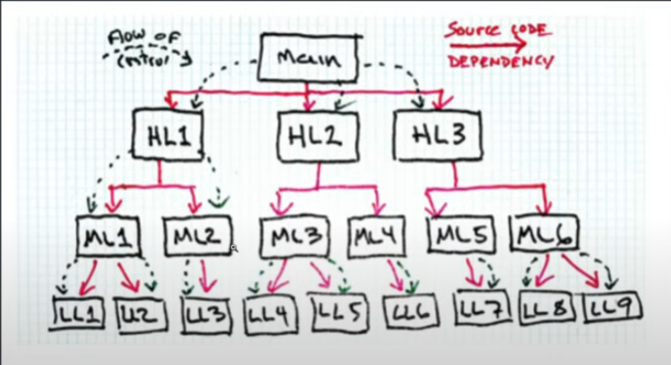

# Arquiteturas e designs mais utilizados

## Dependency Injection (DI)

Esse padrão não é um padrão de arquitetura de código em si, mas é frequentemente usado em conjunto com outros padrões de arquitetura de código para gerenciar dependências entre objetos. DI permite que objetos sejam construídos com suas dependências injetadas, em vez de ter que criá-los internamente.

Esse padrão facilita o gerenciamento de gráficos de objetos complexos e a substituição de componentes por stubs ou objetos simulados para fins de teste.

## Clean Architecture

A **Clean Architecture** é um conjunto de práticas e princípios de design de software que visam criar sistemas robustos, escaláveis e de fácil manutenção. Ela enfatiza a separação de responsabilidades, a modularidade e a clareza do código, garantindo que cada componente do sistema tenha uma função bem definida e que a lógica de negócios seja isolada de detalhes de implementação. Em resumo, a arquitetura limpa busca promover a organização e a legibilidade do código, facilitando sua evolução e adaptação a novos requisitos.

## Hexagonal Architecture (Ports and Adapters)

A **Hexagonal Architecture** é um estilo arquitetônico proposto por Alistair Cockburn que se concentra em manter a lógica de negócios separada das preocupações externas.

O núcleo de negócios interage com outros componentes por meio de portas e adaptadores. Dessa forma, podemos mudar as tecnologias subjacentes sem ter que modificar o núcleo do aplicativo. Como podemos notar pelo diagrama acima, os objetivos de uma **Hexagonal Architecture** são parecidos com os da **Clean Architecture**.

## CQRS

O padrão CQRS (Command Query Responsibility Segregation) é uma abordagem de design de software que separa a leitura e a escrita de dados em diferentes modelos.

## O que é CQRS?

- **Command**: Representa operações que alteram o estado do sistema.
- **Query**: Representa operações que retornam dados sem modificar o estado.

## Benefícios do CQRS:

1. **Escalabilidade**: Permite escalar a leitura e a escrita de forma independente.
2. **Modelagem mais clara**: Separa preocupações de leitura e escrita, facilitando a manutenção.
3. **Desempenho**: Otimiza operações de leitura e escrita de acordo com suas necessidades específicas.

## Implementação do CQRS:

Para o presente exemplo teremos duas bases de dados, uma irá guardar os eventos de mudança, ou seja, os resultados do processamento de um comando e a outra irá guardar os dados em uma base relacional a fim de realizarmos consultas naturais, com selects, joins, etc.

Lembrando sempre que:
- **Comandos**: Alteram o estado do sistema.
- **Consultas**: Retornam dados sem modificar o estado.
- **Modelos separados**: Um para leitura e outro para escrita.

As operações de Sync entre os modelos de dados (query model e command model) podem ser feitas de muitas formas, desde o uso de CDC (Change Data Capture), ou Usando o Transactional Outbox Pattern, ou da forma simplória como foi abordada neste exemplo.

## Teorema de CAP (Consistency, Availability, Partition Tolerance)

Em sistemas distribuídos, é comum enfrentar o desafio de manter a consistência dos dados, especialmente ao adotar o paradigma do CQRS, que requer lidar com bases otimizadas para diferentes operações.

O Teorema CAP afirma que em um sistema distribuído, é impossível garantir simultaneamente consistência, disponibilidade e tolerância a partições. Um sistema distribuído só pode garantir duas dessas propriedades ao mesmo tempo, sendo necessário fazer trade-offs entre elas.

## Conclusão

A motivação por tras deste exemplo é fazer uma abordagem poderosa para lidar com operações de leitura e escrita de forma eficiente e escalável. Separando responsabilidades, e melhorando a manutenção e o desempenho do sistema.